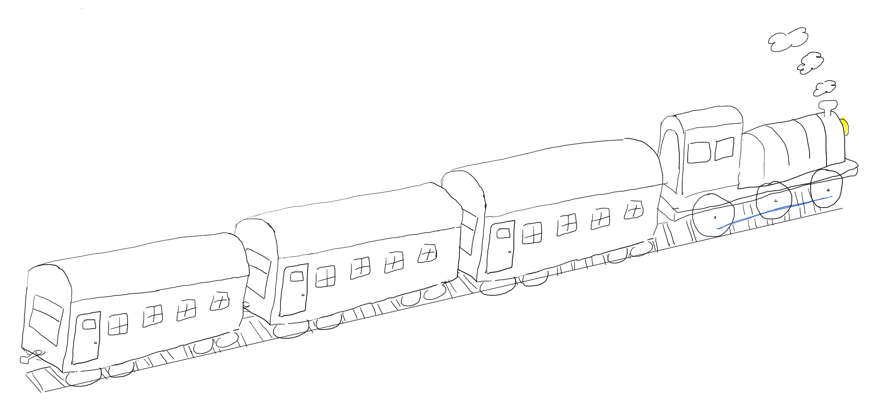

# Projekt GKOM - Pociąg

## Autorzy
|Imię Nazwisko|
|-|
|Paweł Kotiuk|
|Maciej Kowalski|
|Mateusz Chruściel|
|Michał Sobieraj|

## Wstępny szkic

## Milestones
1.Gotowa lista zadań
2.Działająca kamera
3.Ukończony model lokomotywy
4.Ukończony model wagonu
5.Stworzenie otoczenia
6.Działa regulacja oświetlenia
7.Pociągiem można sterować interaktywnie
8.Dodane efekty cząsteczkowe
9.Prezentacja gotowego projektu

## Lista Zadań
- [ ] Przygotowanie środowiska pracy
- [ ] Zaplanowanie zadań w ramach narzędzi na GitLabie (stworzenie oraz podział issue-ów, stworzenie metazadań)
- [ ] Szkolenie z obsługi gita oraz GitLaba
- [ ] Zapoznanie się z dokumentacją biblioteki
- [ ] Przygotowanie interfejsów oraz klas do pracy z openGL-em
    - [ ] Ustalenie zakresu zadań, które mają być realizowane za pomocą tych wrapperów
    - [ ] Funkcje oraz obiekty do obsługi figur geometrycznych
    - [ ] Nakładanie więzów na obiekty oraz ich grupowanie
- [ ] Przygotowanie CI
- [ ] Przygotowanie modelu lokomotywy
    - [ ] Podział na figury
    - [ ] Połączenie figur
    - [ ] Nadanie koloru lub tekstur
- [ ] Przygotowanie modelu wagonu
    - [ ] Podział na figury
    - [ ] Połączenie figur
    - [ ] Nadanie koloru lub tekstur
- [ ] Przygotowanie modelu otoczenia (tory, góry, łąka)
    - [ ] Podział na figury
    - [ ] Połączenie figur
    - [ ] Nadanie koloru lub tekstur
- [ ] Przygotowanie tekstur
- [ ] Implementacja ruchomej kamery
- [ ] Obsługa wejść użytkownika

## Wykorzystywane materiały
 - https://learnopengl.com/
 - http://www.songho.ca/opengl/index.html
 - http://cpp0x.pl/kursy/Kurs-OpenGL-C++/101
