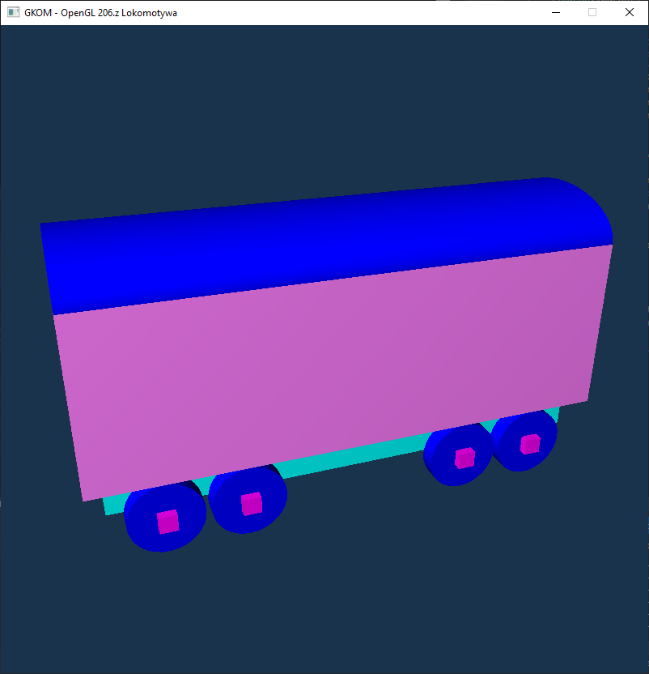

# Projekt GKOM - Pociąg

## Autorzy
| Imię Nazwisko     |
| ----------------- |
| Paweł Kotiuk      |
| Maciej Kowalski   |
| Mateusz Chruściel |
| Michał Sobieraj   |

## Wstępny szkic

## Milestones

1. Przygotowanie bazy projektu  
2. Działająca kamera  
3. Ukończony model wagonu   
4. Ukończony model lokomotywy  
5. Stworzenie otoczenia  
6. Działa regulacja oświetlenia  
7. Generowanie modelu w ruchu
8. Pociągiem można sterować interaktywnie  
9. Ukończenie bazy programistycznej projektu
10. Prezentacja gotowego projektu  

## Lista Zadań
Lista zazdań w formie oddzielnych issues [tutaj](http://gitlab.ii.pw.edu.pl/gkom.20z/206.-pociag/-/issues?scope=all&utf8=%E2%9C%93&state=all)
- [x] Przygotowanie środowiska pracy
- [x] Zaplanowanie zadań w ramach narzędzi na GitLabie (stworzenie oraz podział issue-ów, stworzenie metazadań)
- [x] Stworzenie klas bazowych (pustych interfejsów) dla renderowanych obiektów
- [x] Zapoznanie się z dokumentacją biblioteki
- [x] Przygotowanie interfejsów oraz klas do pracy z openGL-em
    - [x] Ustalenie zakresu zadań, które mają być realizowane za pomocą tych wrapperów
    - [x] Nakładanie więzów na obiekty oraz ich grupowanie
- [ ] Przygotowanie CI
- [ ] Przygotowanie modelu lokomotywy
    - [x] Podział na figury
    - [x] Połączenie figur
    - [ ] Nadanie koloru lub tekstur
- [ ] Przygotowanie modelu wagonu
    - [x] Podział na figury
    - [x] Połączenie figur
    - [ ] Nadanie koloru lub tekstur
- [ ] Przygotowanie modelu otoczenia (tory, góry, łąka)
    - [x] Podział na figury
    - [x] Połączenie figur
    - [ ] Nadanie koloru lub tekstur
- [ ] Przygotowanie tekstur
- [x] Implementacja ruchomej kamery
- [x] Dodanie obsługi oświetlenia
- [ ] Dodanie elementów świecących
- [ ] Obsługa wejść użytkownika
- [ ] Zarządzanie repozytorium

## Aktualny stan projektu

## Wykorzystywane materiały
 - https://learnopengl.com/
 - http://www.songho.ca/opengl/index.html
 - http://cpp0x.pl/kursy/Kurs-OpenGL-C++/101
